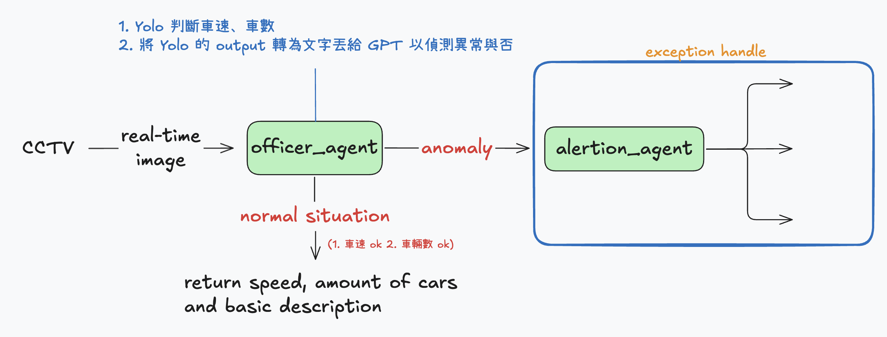

1. build env 
```
pip install -r requirements.txt
```
2. server
```
python3 main1.py 
```
3. client: 啟動拍照
 ```
curl -N http://localhost:8000/api/traffic/stream\?camera_id\=13020
 ```
4. client: 取得 json
```
curl "http://localhost:8000/api/video_json?filename=videos/tmp_13020.json"
```
5.  LLM，api key請用 export 的方式加在環境裡頭
```
cat videos/live_cctv_result.json | python3 agents/observer_agent.py
```
6. 目前所有輸出皆會在 videos/tmp_{camera_id}.json
7. 請搭配網速調整 fps(stream_to_numpy 後面)，然後 _draw_speed_median 可以修改初始速度，目前是以 60 開始計算

PS: 除了 requirements.txt，yolov10s.pt 也請下載於最前面的資料夾路徑


